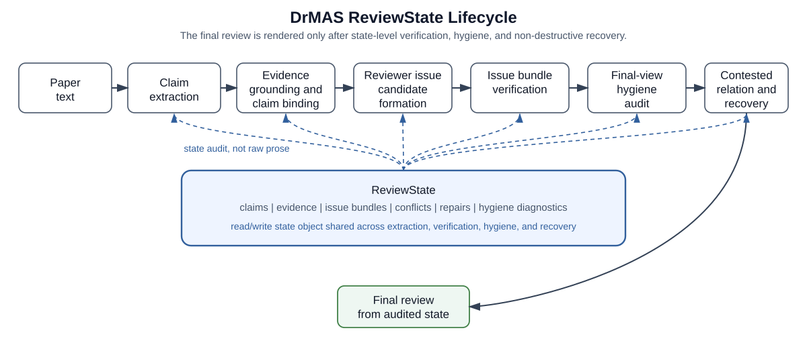
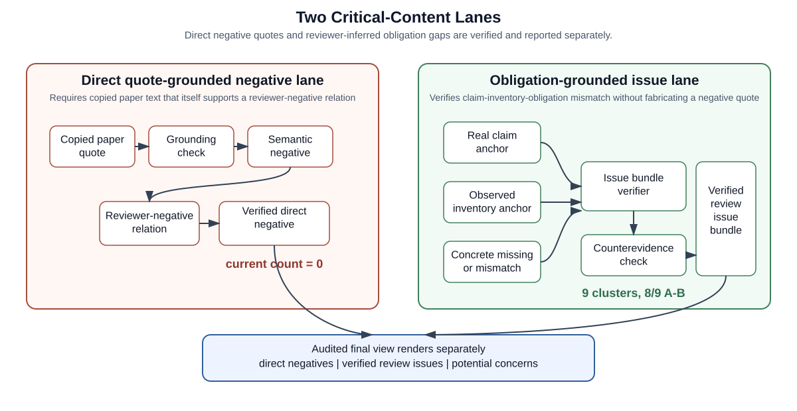
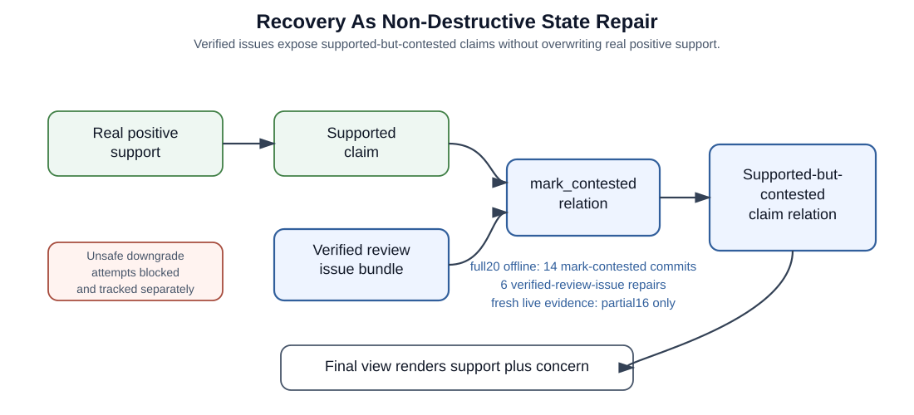
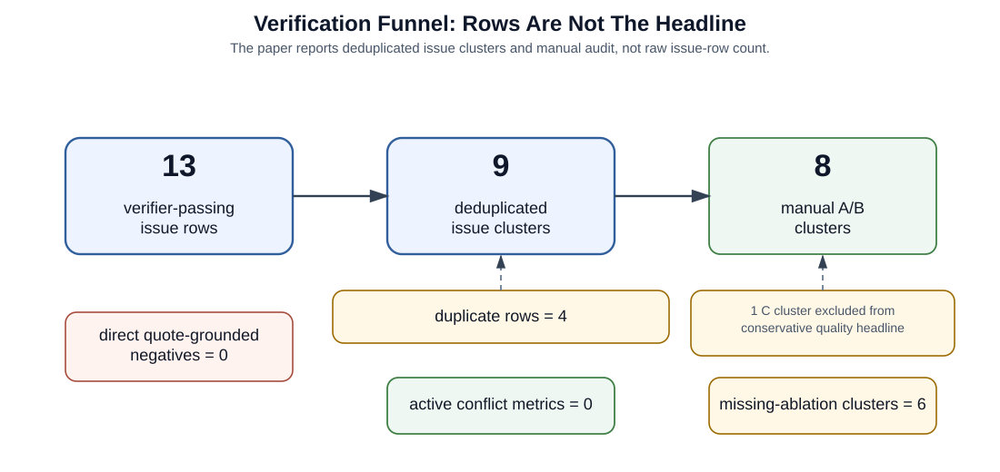

# ReviewState Maintenance for Conservative LLM-Assisted Peer Review

## Abstract

Large language models can generate plausible peer-review text, but fluent reviews may still lose track of which claims are supported, contested, or merely speculative. We present DrMAS, a ReviewState-driven framework for LLM-assisted peer review that represents claims, evidence, reviewer issues, conflicts, hygiene diagnostics, and recovery actions as structured state. DrMAS separates direct quote-grounded negative evidence from obligation-grounded review issues: the latter can be verified through a claim anchor, observed paper inventory, a concrete missing or mismatched entity, and counterevidence checks, without pretending that the paper itself contains a negative sentence. On a hard-negative diagnostic set, DrMAS verifies 13 obligation-grounded issue rows, deduplicating to 9 issue clusters; manual audit judges 8 of 9 clusters valid or defensible. The direct quote-grounded negative lane remains strict and produces no verified direct negatives, highlighting the difference between copied negative quotes and reviewer-inferred issue bundles. Final-view hygiene remains clean in the authoritative artifacts, with zero active negative-grounding conflicts, zero semantic anchor conflicts, zero unlinked negative evidence, and zero positive/neutral negative candidates. These results support a conservative view of LLM review assistance as auditable state maintenance and repair rather than unconstrained review generation.

## 1. Introduction

Large language models can generate plausible peer-review text, but plausibility is not the same as review reliability. A useful review needs to preserve several distinctions at once: what the paper actually claims, what evidence supports each claim, which concerns are grounded in the paper, which concerns are reviewer-inferred, which supported claims are still contested, and which weak signals should remain speculative rather than become asserted defects. In a single-pass review-generation pipeline, these distinctions are easy to collapse into fluent prose. The result can look coherent while losing track of the underlying review state.

This problem is especially visible for negative or critical review content. Some criticisms can be grounded in a direct paper quote: a result may underperform a baseline, a table may contradict a claimed improvement, or an evaluation protocol may explicitly invalidate a claim. Many useful reviewer concerns, however, are not written as negative sentences in the paper. A paper usually does not say that it lacks a decisive ablation, omits a relevant baseline family, or leaves a method insufficiently specified for reproduction. These concerns are reviewer-inferred: they arise from a mismatch between a claim, the evidence obligations implied by that claim, and the inventory of experiments or method details that the paper actually provides.

Treating all critical content as "negative evidence" is therefore too narrow. It encourages systems either to overfit to copied negative-looking text or to fabricate defects when no such text exists. A safer review assistant should instead maintain a structured state that separates direct quote-grounded negatives from obligation-grounded reviewer issues. Direct negatives require a copied quote that itself supports the reviewer-negative relation. Obligation-grounded issues require a different evidence package: a real claim anchor, an observed inventory anchor, a concrete missing or mismatched entity, and a counterevidence check showing that the paper does not already satisfy the obligation.

We introduce DrMAS, a ReviewState-driven framework for LLM-assisted reviewing. DrMAS does not ask an LLM to directly emit the final review. It incrementally builds a structured ReviewState containing claims, evidence records, flaw or concern candidates, verified review issue bundles, conflict relations, recovery patches, and final-view hygiene diagnostics. The final review is rendered from this audited state rather than from raw model prose.

The core design is a two-lane treatment of critical review content. The first lane is direct quote-grounded negative evidence. It is deliberately strict: a record counts only when a paper-grounded quote, semantic negative relation, reviewer-negative relation, real claim binding, and flaw or issue linkage all succeed. The second lane is obligation-grounded review issue verification. A reviewer issue can be verified without a copied negative quote when it is supported by a claim-inventory-obligation mismatch. This lets DrMAS represent concerns such as missing ablations, missing baseline families, and reproducibility gaps without pretending that the paper itself contains a negative sentence.

DrMAS also treats recovery as state repair, not as decision correction. When a claim has real positive support but is contested by a verified issue, the preferred repair is to mark the claim as supported-but-contested. The system does not need to destructively downgrade the claim status to expose the concern. This is important for paper review: a strong contribution can be genuinely supported while still being limited by missing ablations, incomplete comparisons, or insufficient reproducibility details.

We evaluate DrMAS on the hardneg20 diagnostic set, which stresses negative-evidence and reviewer-issue handling. The result should be read conservatively. The direct quote-grounded negative lane remains strict and produces no verified direct negatives. The main result is instead obligation-grounded issue verification: on a hardneg20 offline recompute, DrMAS verifies 13 review issue rows that deduplicate to 9 issue clusters, with manual audit judging 8 of the 9 clusters valid or defensible. The final-view hygiene checks remain clean: active negative-grounding conflicts, semantic anchor conflicts, semantic negatives without verified review relation, unlinked negative evidence, and positive/neutral negative candidates are all zero in the authoritative artifacts.

These results support a narrower but stronger claim than broad autonomous review generation. DrMAS shows that review-critical information can be represented as auditable state objects, verified through explicit lifecycle checks, and surfaced through non-destructive recovery. The system does not yet solve direct quote-grounded negative discovery, broad issue diversity, or autonomous Critique-driven candidate recall. Most current verified issues are missing-ablation heavy and many come from deterministic reviewer seeds. We treat these as limitations rather than hiding them behind aggregate counts.

This paper makes the following contributions:

1. We formulate LLM-assisted reviewing as ReviewState maintenance rather than direct review generation, representing claims, evidence, reviewer issues, conflicts, hygiene diagnostics, and recovery actions as structured state.
2. We distinguish direct quote-grounded negative evidence from obligation-grounded review issues, preventing reviewer-inferred absence concerns from being falsely counted as copied paper-negative quotes.
3. We introduce a conservative review issue bundle verifier that checks claim anchors, observed inventory anchors, concrete missing or mismatched entities, counterevidence, and review-worthiness before a concern enters the verified issue view.
4. We implement final-view hygiene checks that suppress common false-negative artifacts, including positive or neutral text misused as negative evidence, stale absence records, quote-bank artifacts, retrieval gaps, and unlinked negative evidence.
5. We show that verified issues can drive non-destructive recovery through contested relations, preserving supported claims while exposing unresolved review concerns.

The broader lesson is that reliable LLM-assisted reviewing is not only a prompting problem. It is a state-management problem. A review assistant needs to know not just what it wants to say, but why each statement is allowed to appear in the final review and what status it has in the review lifecycle.

## 2. Related Work

### 2.1 LLM-Assisted Peer Review

Recent work studies whether large language models can provide useful feedback on research papers, summarize manuscripts, identify weaknesses, or assist reviewers during peer review \citep{liang2023llmfeedback}. These systems often evaluate generated review text directly: whether it is helpful, whether it overlaps with human reviews, or whether authors and reviewers perceive it as useful.

DrMAS addresses a complementary problem. Instead of treating review generation as the main object, it treats the intermediate review state as the object that must be maintained, audited, and repaired. This distinction matters because a fluent review can mix grounded strengths, unsupported criticisms, author-stated limitations, retrieval failures, and speculative concerns in the same prose. DrMAS therefore represents claims, evidence, reviewer issues, conflicts, and recovery actions as structured state before rendering the final review.

The current results should not be framed as showing that DrMAS is a better general review generator. The evidence supports a narrower claim: DrMAS can verify obligation-grounded review issue bundles and suppress measured false-negative-evidence artifacts on a diagnostic hard-negative set.

### 2.2 Retrieval-Augmented And Grounded Scientific Assistance

Retrieval-augmented generation and grounded scientific QA systems aim to reduce hallucination by conditioning generation on source documents and requiring evidence citations \citep{lewis2020rag,gao2023alce,wadden2020scifact}. In paper-review settings, this usually means retrieving relevant excerpts and asking the model to justify its comments with quotations or citations.

DrMAS uses grounding, but the central contribution is not retrieval alone. The system distinguishes paper quotes that directly support a claim from neutral inventory anchors that support an absence-style review issue. For example, an experiment table can be positive or neutral paper content while still serving as the observed inventory anchor for a missing-ablation concern. This lets DrMAS verify reviewer issues that are not directly expressed as negative paper sentences.

This is a key difference from a pure quote-grounding view. If a system requires every criticism to be backed by a copied negative quote, it will miss many real reviewer issues. If it relaxes quote requirements without state checks, it risks fabricating defects. DrMAS instead verifies a claim-inventory-obligation mismatch as a structured bundle.

### 2.3 Factuality, Attribution, And Evidence Verification

A large body of work studies factuality, attribution, and evidence verification for generated text \citep{rashkin2021attribution,thorne2018fever,wadden2020scifact}. These methods ask whether generated statements are supported by source material, whether citations are faithful, or whether an answer contradicts evidence.

DrMAS inherits the same concern but applies it to the lifecycle of a review. The unit of verification is not only a generated sentence. It can be a state object: a claim binding, an evidence record, a review issue bundle, a contested relation, or a recovery patch. This state-level view makes it possible to ask more specific questions: whether evidence is grounded in the paper, whether it supports a real claim rather than a fallback artifact, whether a negative label is semantically appropriate, whether a reviewer issue is a direct negative or an obligation-grounded absence issue, and whether the final report is using stale or unlinked evidence.

The hygiene metrics in our evaluation are examples of this state-level verification. Active negative-grounding conflicts, semantic anchor conflicts, semantic negatives without review relation, unlinked negative evidence, and positive/neutral negative candidates are tracked explicitly rather than hidden inside generated prose.

### 2.4 Multi-Agent Reviewing And Self-Correction

Agentic LLM systems often divide a task among roles, such as planner, retriever, verifier, critic, and editor \citep{wu2023autogen,li2023camel}. Self-correction systems ask models to critique and revise their own outputs, sometimes with tool use or external feedback \citep{madaan2023selfrefine,shinn2023reflexion}.

DrMAS uses multiple roles, but the paper should not frame the contribution as "more agents." The contribution is the persistent ReviewState that agents read and update. Without explicit state semantics, a critic can produce plausible objections that are not grounded, and a repair step can overwrite useful support while trying to fix a flaw. DrMAS constrains repair through typed operations such as contested relations, preserving supported claims while exposing verified issues.

This also explains why recovery is reported as state repair, not decision correction. The current system does not claim to fix accept/reject decisions. It exposes supported-but-contested claims, blocks unsafe downgrade behavior, and records repair attempts in the state.

### 2.5 Review-State And Argument-State Representations

Structured argumentation and evidence graphs represent claims, supports, attacks, and relations among evidence \citep{lawrence2020argumentmining,thorne2018fever,wadden2020scifact}. These lines of work are relevant because peer review is not just text generation; it is an argument about a paper's claims, evidence, limitations, and unresolved risks.

DrMAS can be positioned as a review-specific state representation. A ReviewState includes paper claims, evidence records, issue bundles, conflict relations, recovery logs, and final-view hygiene diagnostics. The review issue bundle is especially important: it represents a reviewer concern as a typed relation among a claim anchor, observed inventory, a missing or mismatched entity, and counterevidence checks.

This differs from ordinary argument mining because the state is operational. The system uses the state to decide whether evidence can count, whether a concern should be verified or remain diagnosis-pending, whether a claim should be marked contested, and whether the final report is allowed to render a flaw.

### 2.6 Positioning Summary

DrMAS sits at the intersection of LLM-assisted reviewing, grounded generation, factuality verification, and agentic self-correction. Its distinguishing claim is that reviewing should be treated as auditable state maintenance. The final review should not be trusted merely because it is fluent or quote-rich. It should be trusted only insofar as its claims, evidence, reviewer issues, conflicts, and repairs survive explicit state-level checks.

The current empirical evidence supports this positioning conservatively. DrMAS does not solve direct quote-grounded negative discovery and does not establish broad autonomous issue discovery. It does show that obligation-grounded review issues can be verified as state objects and that measured false-negative-evidence failure modes can be kept out of the final view.

## 3. Method

### 3.1 Overview

DrMAS treats LLM-assisted reviewing as a state maintenance problem. Instead of asking a model to directly produce a final review, the system incrementally builds a structured ReviewState, audits that state, and renders the final review from an audited view.



Figure 1. DrMAS treats LLM-assisted reviewing as ReviewState maintenance. The system extracts claims, grounds evidence, forms and verifies review issue bundles, audits the final view, and applies non-destructive recovery before rendering a final review. The central object is the ReviewState, not raw generated prose.

At a high level, the pipeline starts from paper text, extracts paper claims, grounds and binds evidence to those claims, forms reviewer issue candidates, verifies review issue bundles, applies final-view hygiene, performs non-destructive recovery when needed, and renders the final report from the audited view. The central design decision is to keep direct quote-grounded negative evidence separate from obligation-grounded review issues. A direct quote-grounded negative must be a copied paper quote that itself supports a reviewer-negative relation. An obligation-grounded review issue may instead be verified from a claim anchor, observed paper inventory, a concrete missing or mismatched entity, and the absence of resolving counterevidence.

### 3.2 ReviewState

We define a ReviewState as a structured state object:

```text
S = (C, E, F, G, I, K, R, H)
```

where `C` is the set of extracted paper claims; `E` is the evidence map; `F` is the set of flaw or concern candidates; `G` is the set of evidence gaps and unresolved questions; `I` is the set of verified review issue bundles; `K` is the set of conflict or contested relations; `R` is the recovery patch log; and `H` is the final-view hygiene audit.

Each claim carries an identifier, text, status, type, importance, coverage tags, and optional claim obligations. Each evidence record carries an identifier, claim binding, quote or inventory text, source locator, stance, strength, grounding labels, semantic labels, and review-negative labels when applicable. The final report is not rendered from raw model output; it is rendered from an audited state view.

### 3.3 Evidence Grounding And Claim Binding

DrMAS first grounds evidence against the paper and binds it to real claims. The evidence map records the target claim, raw quote or evidence text, source locator, source bucket, grounding label, semantic label, stance, strength, binding status, and binding rationale.

The system distinguishes support evidence from negative or missing evidence. Accept-like support requires real-claim binding and verified evidence quality. This prevents fallback claims, parser artifacts, or context-only snippets from becoming accept-level support. This evidence layer also builds neutral paper inventory. Inventory is not treated as negative evidence. It is used later to verify whether a reviewer issue is a real claim-inventory-obligation mismatch.

### 3.4 Two Critical-Content Lanes

DrMAS uses two separate lanes for review-critical information.



Figure 2. DrMAS separates direct quote-grounded reviewer negatives from obligation-grounded review issues. The first lane requires a copied paper quote that itself supports a reviewer-negative relation. The second lane verifies issues from a claim-inventory-obligation mismatch, allowing concerns such as missing ablations or missing baselines to be represented without fabricating negative quotes.

The direct lane is intentionally strict. A record can count as a quote-grounded reviewer negative only if it passes all of the following checks:

```text
paper-grounded quote
AND semantic negative relation
AND reviewer-negative relation
AND real claim binding
AND non-noise negative type
AND linked flaw or issue
```

This lane is counted by `review_negative_verified_count`. The reported diagnostic run shows that this lane remains hard: `review_negative_verified_count=0`. We present this as an honest limitation, not as a hidden failure.

The second lane verifies reviewer issues that are not copied negative quotes. This is the current main mechanism. An obligation-grounded issue is represented as a review issue bundle containing an issue identifier, claim identifier, issue type, required evidence type, claim anchor, observed inventory anchor, missing or mismatched entity, source of expectation, verification status, and an explicit marker that the issue is not a quote-negative record. This lane is counted by `verified_review_issue_count` and deduplicated by `verified_review_issue_cluster_count`.

### 3.5 Review Issue Bundle Verification

The verifier checks whether a candidate review issue is auditable from the paper state. Conceptually, a candidate bundle becomes a verified issue only if:

```text
real_claim
AND locatable_claim_anchor
AND concrete_missing_or_mismatch_entity
AND auditable_expectation
AND verifiable_observed_inventory
AND issue_type_relevant_inventory
AND missing_entity_not_already_observed
AND no_ablation_or_full_text_counterevidence
AND review_worthiness_gate
AND not_author_limitation_or_retrieval_gap
```

Important verifier gates include claim anchor locatability, source-of-expectation checks, concrete missing item checks, missing-baseline specificity, missing-ablation target quality, observed inventory availability and relevance, counterevidence from inventory and full text, review-worthiness checks, and rejection of author self-limitations, generic gaps, and retrieval gaps.

For missing-ablation issues, the target-quality gate is particularly important. Generic targets such as bare "encoder", "decoder", "network", "component", action fragments, or ordinary training actions are rejected or downgraded. Named contribution mechanisms or paper-specific performance-driving components may pass as high or medium confidence.

The verifier is deliberately precision-oriented. A rejected candidate may still be useful as a diagnosis-pending concern, but it is not counted as a verified review issue.

### 3.6 Materializing Verified Issues

When a bundle is verified, DrMAS materializes it as structured state rather than as an unstructured criticism. The materialized record says that the issue is verified by absence or coverage audit, not by a direct negative quote. The final view can then render it as a verified review issue or contested concern without mixing it into `review_negative_verified_count`.

This distinction is important for the paper's safety story. The system can surface a missing-ablation or missing-baseline issue while still refusing to call a neutral experiment table a negative quote. It can also leave a candidate as diagnosis-pending when the missing item, inventory anchor, or counterevidence check is insufficient.

### 3.7 Final-View Hygiene

The final-view hygiene pass constructs an audited decision/report view. This view verifies evidence records against the current state, builds evaluation and method inventory, performs claim-requirement audit, materializes verified review issue bundles, filters stale gaps and stale conflicts, reconciles support in the audited view, downgrades unsafe flaws, tracks active negative-grounding conflicts, and deduplicates review issue rows into clusters.

This step prevents false negative-evidence artifacts from leaking into the final review. In the reported artifacts, stale reviewer-absence anchors and quote-bank negative candidates that no longer pass the verifier are treated as safe rejections, not active conflicts.

### 3.8 Recovery As Non-Destructive Repair

Recovery is not a mechanism for forcing accept/reject decisions. It is a mechanism for repairing ReviewState inconsistencies. The preferred recovery action is `mark_contested`: a supported claim can remain supported while being marked contested by a verified review issue.



Figure 4. Recovery in DrMAS is non-destructive. Verified review issues can create a supported-but-contested relation rather than downgrading a claim that has real positive support.

This preserves a supported claim while exposing that a verified issue contests its sufficiency or scope. Unsafe downgrade attempts are tracked separately and should not be described as the main recovery path. The paper should describe recovery as:

```text
supported claim + verified issue -> supported-but-contested relation
```

and not as:

```text
verified issue -> downgrade claim status
```

### 3.9 Rendering The Final Review

The final report is rendered from the audited view. This lets the report distinguish strengths supported by real evidence, direct quote-grounded reviewer negatives if any, obligation-grounded verified review issues, diagnosis-pending concerns, assessment limitations, contested claims, and unresolved questions.

This design is essential to the paper narrative. The final review should not collapse all weak signals into a single flaw list. It should preserve the lifecycle state of each concern.

The implementation appendix maps these paper concepts to code anchors and regeneration scripts. The main text keeps function names out of the core narrative except where needed to define the experimental artifacts.

## 4. Experiments

### 4.1 Research Questions

We evaluate DrMAS around four questions that follow from the ReviewState thesis.

RQ1 asks whether the system can verify reviewer issues without relying on copied negative quotes. This tests the obligation-grounded review issue bundle pathway. The expected evidence is not a negative sentence from the paper, but a verified mismatch among a paper claim, observed inventory, and a concrete missing or mismatched entity.

RQ2 asks whether the final view suppresses unsafe negative-evidence artifacts. This tests whether positive statements, author limitations, quote-bank artifacts, retrieval gaps, and stale absence records are prevented from becoming active negative-grounding conflicts.

RQ3 asks whether verified issues can trigger non-destructive recovery. This tests whether supported claims can remain supported while being marked contested by verified review issues, rather than being destructively downgraded.

RQ4 asks what still limits the current system. This covers the remaining gap between a conservative state-verification framework and broad autonomous reviewer issue discovery.

### 4.2 Evaluation Setting

We use the hard-negative diagnostic set `hard_negative_20_20260611.parquet`, a 20-paper subset designed to stress negative-evidence and reviewer-issue handling. The main reported run is the P28.6 TargetRefine2 offline recompute over a completed MiMo v2.5 hardneg20 run:

```text
P28_6_CONFLICTFIX_TARGETREFINE2_194911_*
```

The run uses the P28 review-issue bundle pipeline with negative quote hygiene, targeted negative search, free-form reviewer issue candidates, and conservative final-view hygiene. We report the P28.6 recompute because it applies the final verifier and conflict-cleaning logic consistently to the completed run.

We also include a fresh MiMo rerun sanity check:

```text
P28_6_CONFLICTFIX_MIMO_PARTIAL16_224133_*
```

This run completed 16 of 20 papers before the MiMo API returned `402 Insufficient account balance`. We use it only as a partial consistency check, not as the main full20 result.

### 4.3 Metrics

We distinguish direct quote-grounded negatives from obligation-grounded review issues.

A direct quote-grounded negative is a paper quote that itself supports a reviewer-negative relation after grounding, semantic, and review-relation verification. This is counted by `review_negative_verified_count`.

An obligation-grounded review issue is a verified issue bundle supported by a real claim anchor, observed inventory anchor, concrete missing or mismatched entity, and a counterevidence check. This is counted by `verified_review_issue_count` and deduplicated by `verified_review_issue_cluster_count`.

We report rows and clusters separately. Rows are individual verified issue records. Clusters deduplicate repeated detections of the same issue target in the same paper. The paper-level headline uses clusters.

Safety and hygiene metrics include active negative-grounding conflicts, semantic anchor conflicts, semantic negatives without review relation, unlinked negative evidence, and positive/neutral negative candidates. Recovery metrics include mark-contested commits, verified-review-issue repairs, and unsafe downgrade attempts blocked.

### 4.4 Main Result: Verified Review Issue Bundles

Table 1 reports the P28.6 full20 offline recompute. DrMAS verifies 13 review issue rows, which collapse to 9 issue clusters. Manual audit judges 8 of the 9 clusters as valid or defensible reviewer concerns.

| Metric | Value |
| --- | ---: |
| papers | 20 |
| direct quote-grounded reviewer negatives | 0 |
| verified review issue rows | 13 |
| verified review issue clusters | 9 |
| duplicate review issue rows | 4 |
| reviewer-candidate issue rows | 13 |
| critique-payload candidate rows | 2 |
| deterministic-seed candidate rows | 11 |
| claim-obligation fallback rows | 0 |
| verified missing-ablation clusters | 6 |
| active negative grounding conflicts | 0 |
| semantic anchor conflicts | 0 |
| semantic negatives without review relation | 0 |
| unlinked negative evidence | 0 |
| positive/neutral negative candidates | 0 |
| protection | PASS |

Table 1. Main hardneg20 diagnostic result. Rows are raw verified records, while clusters deduplicate repeated issue targets within a paper. The direct quote-grounded negative lane remains strict and produces no verified direct negatives in this run.



Figure 3. P28.6 reports review issue quality at the cluster level. Thirteen verifier-passing issue rows deduplicate to nine issue clusters; manual audit judges eight clusters valid or defensible. Raw row count is not used as the paper headline.

The key interpretation is that the useful negative-review signal does not appear as copied paper-negative text. It appears as verified claim-inventory-obligation mismatch. This supports the ReviewState thesis: reviewer issues should be represented as auditable state objects rather than as unstructured negative snippets.

### 4.5 Manual Cluster Audit

Table 2 summarizes the manual cluster audit. Three clusters are strong A-class issues; five are defensible B-class issues; one is a C-class concern that should not be counted in a paper-ready precision headline.

| Cluster target | Issue type | Manual label | Paper use |
| --- | --- | --- | --- |
| recurrent draft model | missing_ablation | A | strong case study |
| acceptance prediction head | missing_ablation | A | strong case study |
| generalized noise regularization | missing_ablation | A | strong case study |
| class-balancing CE loss | missing_ablation | B | defensible example |
| GrCN / ControllNet reproducibility details | reproducibility_gap | B | defensible example |
| PropGCL transformation phase / weights | missing_ablation | B | defensible example |
| recent GNN / graph-transformer baselines | missing_baseline | B | defensible example |
| EqualAL baseline | missing_baseline | B | defensible example |
| number of motion components beyond K=4 | missing_ablation | C | exclude from conservative quality count |

Table 2. Manual audit of verified issue clusters. We report 8 of 9 A/B clusters as the conservative quality count and exclude the C-class cluster from the paper-ready precision headline.

The issue distribution is intentionally reported as a limitation: 6 of the 9 clusters are missing-ablation issues, 2 are missing-baseline issues, and 1 is a reproducibility issue. This is enough to demonstrate the issue-bundle verification mechanism, but not enough to claim broad reviewer issue diversity.

### 4.6 Recovery And Safety

Table 3 reports recovery and safety signals. The main recovery action is `mark_contested`: a supported claim can remain supported while being marked contested by a verified review issue. This is non-destructive state repair, not a decision override.

| Metric | Full20 offline | Fresh partial16 |
| --- | ---: | ---: |
| completed papers | 20 | 16 |
| mark-contested commits | 14 | 5 |
| verified-review-issue repairs | 6 | 5 |
| unsafe downgrade attempts blocked | 1 | 2 |
| active negative grounding conflicts | 0 | 0 |
| semantic anchor conflicts | 0 | 0 |
| unlinked negative evidence | 0 | 0 |
| positive/neutral negative candidates | 0 | 0 |

Table 3. Recovery and safety metrics. Verified issues can expose supported-but-contested claims without destructively downgrading claim status. The fresh partial16 rerun is included only as a consistency check because the MiMo account balance stopped the run before all 20 papers completed.

The recovery result should be phrased carefully. The full20 result is an offline recompute over a completed run, so its recovery counts should not be described as a fresh full20 live rerun. The fresh partial16 run gives a cleaner live-run sanity check, but it is incomplete.

### 4.7 Interpretation Of The Diagnostic Result

The diagnostic result should not be read as a simple count-maximization exercise. Earlier development runs produced more issue rows by allowing generic or malformed missing-ablation targets, but those rows were not paper-ready. The current reported result is intentionally smaller because it applies target-quality checks, counterevidence checks, clustering, and final-view conflict cleanup before a concern can be counted as a verified review issue.

This interpretation matters for the paper. The contribution is not that the system maximizes the number of criticisms. The contribution is that it separates candidate generation from conservative issue verification, reports row-level duplicates separately from cluster-level issues, and keeps stale or quote-bank false-negative anchors out of the final view.

## 5. Discussion

The strongest current result is not the number of negative quotes. In fact, direct quote-grounded reviewer negatives remain at zero. This is consistent with the main insight: many useful review concerns are not negative sentences in the paper. They are reviewer-inferred obligation gaps that require structured verification.

The system currently verifies 9 issue clusters and passes the measured hygiene protections. This supports a conservative claim: DrMAS can turn reviewer-style concerns into auditable ReviewState objects and prevent several common false-negative-evidence failure modes.

The result also clarifies what row counts can and cannot mean. A row is an individual verified issue record. A cluster is a deduplicated issue target within a paper. Since repeated detections can attach to overlapping claims, the paper should report cluster count and manual audit rather than raw row count. This is why the headline is 9 clusters, with 8 of 9 judged valid or defensible, rather than 13 independent defects.

The result is not yet a broad autonomous review benchmark. Most verified issues come from deterministic reviewer seeds rather than Critique payload candidates, and the issue distribution is missing-ablation heavy. The appropriate next step is not to loosen the verifier, but to improve entity-level obligation extraction and Critique-driven candidate generation while preserving the same final-view protections.

## 6. Limitations

This experiment has five important limitations.

First, the direct quote-grounded negative lane remains weak: `review_negative_verified_count=0`. This is a limitation of the current system and a motivation for separating direct negative quotes from obligation-grounded issues.

Second, the issue distribution is narrow. The current verified clusters are mostly missing-ablation issues, with fewer missing-baseline and reproducibility examples.

Third, the candidate source distribution shows that autonomous Critique discovery is immature: only 2 verified rows come from Critique payload candidates, while 11 come from deterministic reviewer seeds.

Fourth, the fresh MiMo rerun is incomplete. It stopped at 16 of 20 papers because the MiMo API returned `402 Insufficient account balance`.

Fifth, hardneg20 is a diagnostic set. It is useful for stress-testing ReviewState hygiene and reviewer issue verification, but it is not enough by itself to support broad benchmark claims.

This evidence is sufficient for a conservative framework paper, but not for a broad benchmark claim. A fresh full20 run with the current code would strengthen stability and live-run confidence. Until that run is available, the paper should explicitly describe the main full20 result as an offline recompute and the partial16 result as the freshest live sanity check.

## 7. Conclusion

LLM-assisted peer review should not be evaluated only as a problem of generating fluent review text. A useful review assistant must track what is supported, contested, speculative, stale, or unsafe to render. DrMAS addresses this by maintaining an explicit ReviewState with claims, evidence, review issues, conflicts, hygiene diagnostics, and recovery actions.

The current diagnostic results show that obligation-grounded review issues can be verified conservatively through claim anchors, observed inventory, concrete missing or mismatched entities, and counterevidence checks, while measured false-negative-evidence artifacts are kept out of the final view. The direct quote-grounded negative lane remains unsolved in the current run, and broad autonomous issue discovery remains future work.

The main contribution is therefore a stateful verification and recovery framework for LLM-assisted reviewing: a way to make review text accountable to an auditable lifecycle before it reaches the final report.
