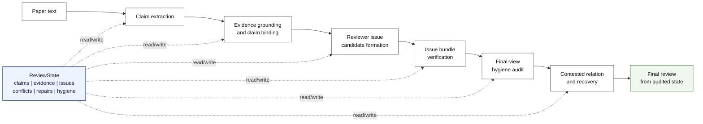
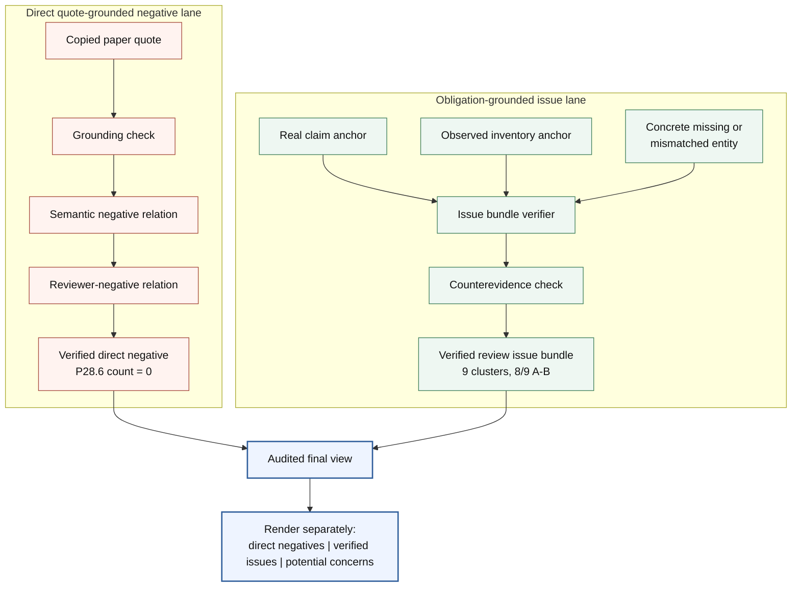
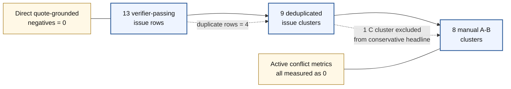
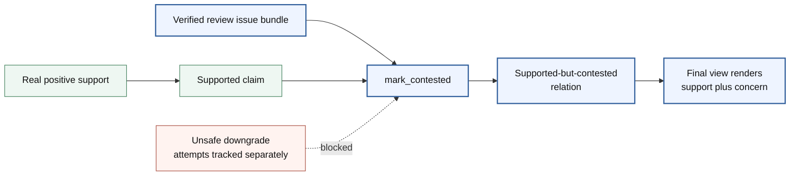

# Paper Figures Draft

Date: 2026-07-01

Status: renderable figure draft. This file converts `PAPER_FIGURE_SPECS_20260701.md` into concrete Mermaid figure sources and paper captions. The source `.mmd` files live in `paper_figures/`.

Do not treat these as final camera-ready figures until the venue format and figure style are chosen. They are designed to be faithful to the current P28.6 narrative and to avoid overstating the result.

Local render status: not rendered in this environment because `mmdc` is unavailable. The Mermaid source has been written conservatively, but SVG/PDF export still needs a render pass.

## Figure Assets

| Figure | Source | Manuscript Placement | Purpose |
| --- | --- | --- | --- |
| Figure 1 | `paper_figures/figure1_reviewstate_lifecycle.mmd` | Method overview | Show ReviewState maintenance lifecycle |
| Figure 2 | `paper_figures/figure2_critical_content_lanes.mmd` | Method, two lanes | Separate direct negatives from obligation-grounded issues |
| Figure 3 | `paper_figures/figure3_verification_funnel.mmd` | Experiments, main result | Prevent row-count inflation |
| Figure 4 | `paper_figures/figure4_non_destructive_recovery.mmd` | Method or appendix | Explain supported-but-contested recovery |

## Figure 1: ReviewState Lifecycle



Caption:

> DrMAS treats LLM-assisted reviewing as ReviewState maintenance. The system extracts claims, grounds evidence, forms and verifies review issue bundles, audits the final view, and applies non-destructive recovery before rendering a final review. The central object is the ReviewState, not raw generated prose.

Audit note: this figure is conceptual. It should not be used to claim that every candidate becomes verified or that the system always finds direct quote-grounded negatives.

## Figure 2: Two Critical-Content Lanes



Caption:

> DrMAS separates direct quote-grounded reviewer negatives from obligation-grounded review issues. The first lane requires a copied paper quote that itself supports a reviewer-negative relation. The second lane verifies issues from a claim-inventory-obligation mismatch, allowing concerns such as missing ablations or missing baselines to be represented without fabricating negative quotes.

Audit note: the figure must preserve the lane separation. Obligation-grounded review issues are not direct quote-grounded negatives, and diagnosis-pending concerns are not verified issues.

## Figure 3: Verification Funnel



Caption:

> P28.6 reports review issue quality at the cluster level. Thirteen verifier-passing issue rows deduplicate to nine issue clusters; manual audit judges eight clusters valid or defensible. Raw row count is not used as the paper headline.

Audit note: this figure exists to prevent metric inflation. Do not describe the 13 rows as 13 independent defects.

## Figure 4: Non-Destructive Recovery



Caption:

> Recovery in DrMAS is non-destructive. Verified review issues can create a supported-but-contested relation rather than downgrading a claim that has real positive support.

Audit note: this figure should be optional in the main paper if space is tight. If used, say that full20 recovery numbers are an offline recompute and that the freshest live evidence is partial16.

## Rendering Notes

Suggested export targets:

```bash
mmdc -i paper_figures/figure1_reviewstate_lifecycle.mmd -o paper_figures/figure1_reviewstate_lifecycle.svg
mmdc -i paper_figures/figure2_critical_content_lanes.mmd -o paper_figures/figure2_critical_content_lanes.svg
mmdc -i paper_figures/figure3_verification_funnel.mmd -o paper_figures/figure3_verification_funnel.svg
mmdc -i paper_figures/figure4_non_destructive_recovery.mmd -o paper_figures/figure4_non_destructive_recovery.svg
```

If Mermaid CLI is unavailable, use the code blocks above directly in a Markdown renderer or convert them manually in the target paper template.

## Figure Claim Guardrails

1. Show `review_negative_verified_count=0` as a limitation, not as hidden text.
2. Use `9 clusters` and `8/9 A-B` as the issue-quality headline.
3. Keep direct quote-grounded negatives and obligation-grounded review issues visually separate.
4. Label recovery as `mark_contested` or supported-but-contested, not downgrade.
5. Do not imply a fresh full20 rerun. Current fresh live evidence is partial16 because MiMo returned `402 Insufficient account balance`.
