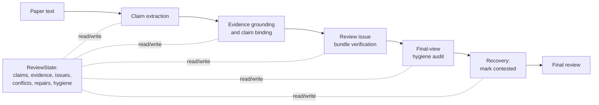
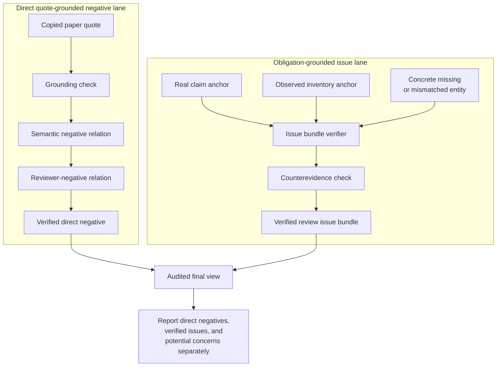
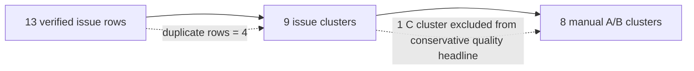
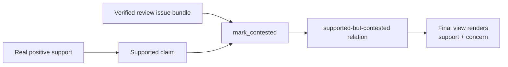

# Paper Figure Specs

Date: 2026-07-01

These specs define figures that match the current P28.6 narrative. They specify what each figure should communicate, what data it can use, and what overclaims it must avoid.

Current render status: each figure now has a Mermaid source plus a manually redrawn SVG and PDF draft in `paper_figures/`. The SVG/PDF files are draft paper assets, but they still need target-template placement and final visual QA.

## Figure 1: ReviewState Lifecycle

### Purpose

Show that DrMAS is not a direct review generator. It maintains and audits a structured ReviewState before rendering the final review.

### Main Message

The final review is produced from audited state objects: claims, evidence, issue bundles, conflicts, hygiene diagnostics, and recovery actions.

### Suggested Placement

Method overview, before the ReviewState schema.

### Layout

Use a left-to-right pipeline with an explicit state box in the middle:



### Visual Notes

- The ReviewState box should be visually central, not a side note.
- Use a distinct style for state read/write edges.
- Do not show agents as the main contribution. Agents are implementation roles; ReviewState is the paper idea.
- Keep "final review" downstream of hygiene and recovery.

### Caption Draft

> DrMAS treats LLM-assisted reviewing as ReviewState maintenance. The system extracts claims, grounds evidence, verifies review issue bundles, audits the final view, and applies non-destructive recovery before rendering a final review. The central object is the ReviewState, not raw generated prose.

### Data Source

Conceptual method figure. It maps to current implementation anchors:

- `merge_review_state`
- `build_decision_hygiene_view`
- `_review_issue_bundle_verification_failure`
- `_sync_verified_review_issues`
- recovery `mark_contested`

### Must Not Imply

- That the pipeline always finds direct quote-grounded negatives.
- That recovery changes accept/reject decisions.
- That every generated concern becomes verified.

## Figure 2: Two Critical-Content Lanes

### Purpose

Explain the paper's most important conceptual distinction: direct quote-grounded negative evidence is not the same as obligation-grounded reviewer issues.

### Main Message

Many real reviewer issues are not copied negative quotes. They can be verified through claim anchors, inventory anchors, concrete missing entities, and counterevidence checks.

### Suggested Placement

Method section, around the "Two Negative Lanes" subsection.

### Layout

Use two parallel lanes that converge only at the audited final view:



### Visual Notes

- The direct lane can be narrower or annotated with "P28.6 count: 0" to make the limitation visible.
- The obligation lane should be visually legitimate, not a fallback or weaker lane.
- Use separate labels for final counts:
  - `review_negative_verified_count`
  - `verified_review_issue_cluster_count`

### Caption Draft

> DrMAS separates direct quote-grounded reviewer negatives from obligation-grounded review issues. The first lane requires a copied paper quote that itself supports a reviewer-negative relation. The second lane verifies issues from a claim-inventory-obligation mismatch, allowing concerns such as missing ablations or missing baselines to be represented without fabricating negative quotes.

### Data Source

Current P28.6 evidence:

- `review_negative_verified_count=0`
- `verified_review_issue_count=13`
- `verified_review_issue_cluster_count=9`
- manual A/B clusters: 8/9

### Must Not Imply

- That obligation-grounded issues are direct negative evidence.
- That diagnosis-pending concerns are verified issues.
- That direct negative quote discovery is solved.

## Figure 3: Verification Funnel

### Purpose

Prevent row-count inflation in the paper narrative. Show how raw verified rows are deduplicated into clusters and manually audited.

### Main Message

The paper headline should be cluster-level quality, not raw row count.

### Suggested Placement

Experiments section, before or after the main P28.6 result table.

### Layout

Use a funnel or step diagram:

```text
13 verifier-passing issue rows
        |
        v
  9 deduplicated issue clusters
        |
        v
  8 manual A/B clusters
```

Add side annotations:

```text
duplicate rows: 4
direct quote negatives: 0
verified missing-ablation clusters: 6
active conflict metrics: 0
```

### Alternative Mermaid Sketch



### Caption Draft

> P28.6 reports review issue quality at the cluster level. Thirteen verifier-passing issue rows deduplicate to nine issue clusters; manual audit judges eight clusters valid or defensible. Raw row count is not used as the paper headline.

### Data Source

Authoritative artifacts:

- `P28_6_CONFLICTFIX_TARGETREFINE2_194911_HARDNEG20_DASHBOARD.md/json`
- `P28_6_CONFLICTFIX_TARGETREFINE2_194911_REVIEW_ISSUE_CASE_TABLE.md/json`
- `P28_5_TARGETREFINE2_MANUAL_CLUSTER_AUDIT_20260630.md`

### Must Not Imply

- That DrMAS found 13 independent defects.
- That all 9 clusters are equally strong.
- That the C cluster should be included in the conservative main claim.

## Optional Figure 4: Recovery As Non-Destructive Repair

### Purpose

Clarify that recovery is about contested relations, not destructive claim downgrade or decision correction.

### Main Message

A supported claim can remain supported while being marked contested by a verified review issue.

### Layout



### Caption Draft

> Recovery in DrMAS is non-destructive. Verified review issues can create a supported-but-contested relation rather than downgrading a claim that has real positive support.

### Data Source

Current P28.6 evidence:

- `mark_contested_commit_count=14` in full20 offline recompute
- `recovery_case_verified_review_issue_repair=6`
- `recovery_unsafe_downgrade_attempt_blocked=1`

### Must Not Imply

- That recovery fixes accept/reject decisions.
- That all mark-contested commits are verified-review-issue repairs.
- That offline full20 recovery counts are a fresh live rerun.

## Figure Production Checklist

Before converting these specs to camera-ready figures:

1. Keep all count labels tied to P28.6 artifacts.
2. Use cluster count, not row count, as the headline.
3. Show direct quote-grounded negatives as a strict lane with current count 0.
4. Keep obligation-grounded issues visually separate from direct negatives.
5. Label recovery as `mark_contested` or supported-but-contested, not downgrade.
6. Avoid agent-role diagrams that make "multi-agent" look like the contribution.
7. Add a footnote or caption caveat that the fresh MiMo live rerun is partial16 until a full20 rerun completes.
